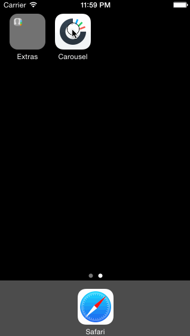

CarouselDemo
============

This is an iOS prototype of the Dropbox app's basic signed out and signed in state. Email and password is hardcoded to "jessefornear@gmail.com" and "password".

Time spent: 10 hours spent in total

Completed user stories:

* Static photo tiles on the initial screen
 * &#10004; Optional: Photo tiles move with scrolling
* Sign In
 * &#10004; Tapping on email/password reveals the keyboard and shifts the scrollview and Sign In button up.
 * &#10004; User sees an error alert when no email is present or no password is present.
 * &#10004; User sees a loading screen upon tapping the Sign In button.
 * &#10004; User sees an error alert when entering the wrong email/password combination.
 * &#10004; User is taken to the tutorial screens upon entering the correct email/password combination.
* Tutorial Screens
 * &#10004; User can page between the screens
 * &#10004; Optional: User can page between the screens with updated dots
 * &#10004; Optional: Upon reaching the 4th page, hide the dots and show the "Take Carousel for a Spin" button.
* Image Timeline
 * &#10004; User can tap on the conversations button to see the conversations screen (push).
 * &#10004; User can tap on the profile image to see the settings view (modal from below).
* Settings
 * &#10004; User can dismiss the settings screen.
 * &#10004; User can log out

Walkthrough of all user stories:

GIF created with [LiceCap](http://www.cockos.com/licecap/).
